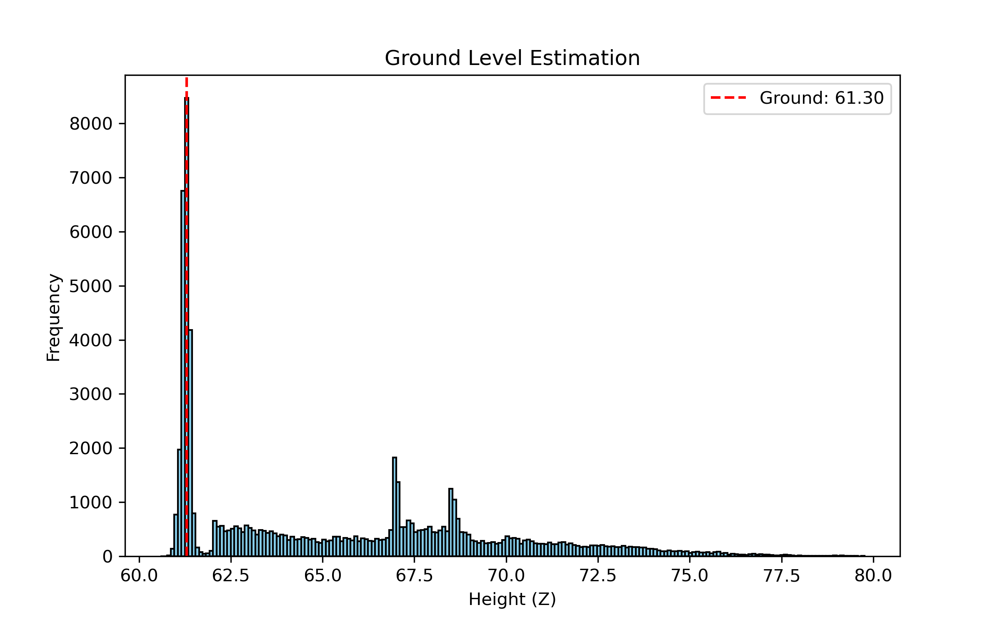
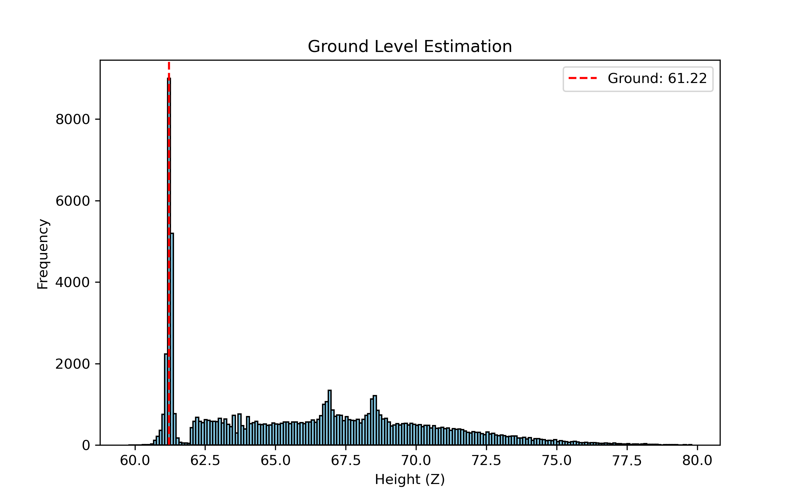

## Task 1: Ground Level Estimation

**Goal:** Estimate the ground level from LiDAR point cloud data using histograms.

### Ground Level Results

| Dataset       | Ground Level (Z) |
|---------------|-----------------|
| dataset1.npy  | 61.30           |
| dataset2.npy  | 61.22           |

### Ground Level Histograms

**Dataset 1:**

**Dataset 2:**

**Notes:**  
- Ground level was estimated by finding the most frequent Z-value in the point cloud data using a histogram with 200 bins.  
- The red dashed line in each histogram indicates the estimated ground level.
